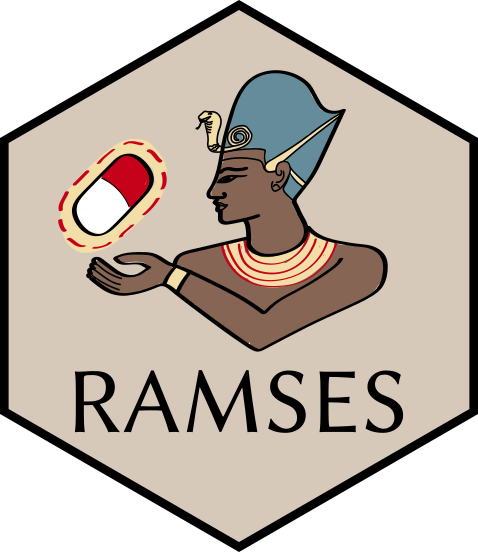

# Ramses: R package for Antimicrobial Stewardship & Surveillance

<!-- badges: start -->

<!-- badges: end -->

<code>Ramses</code> is an analytical software package enabling hospitals to protect antibiotics by monitoring their prescribing and the management of infections using routine electronic health records.

## Overview

`Ramses` is a start-to-finish tool for data warehousing and analysis, supporting:

- initial data preparation and validation; 
- database loading and transformation
- analyses of antibiotic consumption, initiation, and de-escalation
- analyses of infection diagnosing and treatment.

`Ramses` supports routine electronic health records:

- admission/discharge/transfer data and ward movements
- antibiotic prescription and administration records
- microbiology order requests and results
- other clinical investigations (blood counts, vitals, point of care tests. etc.) 

## Features

- measuring antibiotic consumption
<!-- - measuring drug/bug match and rates of microbial culture sampling -->
- integration with the [AMR package](https://msberends.gitlab.io/AMR/) for classification/prediction of resistance phenotypes 
- compatible with SQLite and PostgreSQL databases

## Funders

 &nbsp;&nbsp;
 &nbsp;&nbsp;

## Licence 

Copyright &copy; 2020 University College London

This program is free software; you can redistribute it and/or modify it under the terms of the GNU General Public License as published by the Free Software Foundation; either version 3 of the License, or (at your option) any later version.

This program is distributed in the hope that it will be useful, but WITHOUT ANY WARRANTY; without even the implied warranty of MERCHANTABILITY or FITNESS FOR A PARTICULAR PURPOSE. See the [GNU General Public License](LICENCE.md) for more details.
