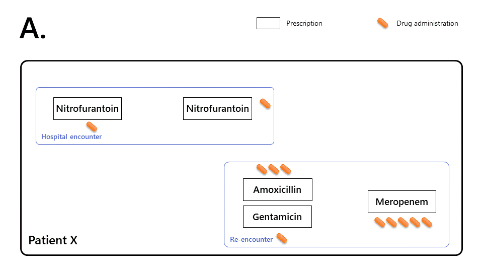

<style type="text/css">
#diagram_caption li {
  font-weight:bold;
}
#diagram_caption > li > p:nth-child(n+2) {
  font-weight:normal;
}
</style>

```{r setup, include = FALSE}
knitr::opts_chunk$set(
  collapse = TRUE,
  comment = "#>"
)
```


# Introduction

Treating infections commonly involves early initiation of empirical antibiotic therapy, with subsequent changes in the drug, dose, and route of administration of antibiotics, ideally informed by organisms isolated from biological samples such as blood or urine.

Much of antimicrobial stewardship is interested in:

* the antibiotic class used to initiate therapy
* subsequent changes to narrower/broader spectrum classes
* use of drug combinations to extend the spectrum of a single antibiotic.

To enable this, Ramses is built around the concept of *antimicrobial therapy episodes*, by linking the set of antimicrobial prescriptions administered consecutively or concurrently in a given patient.


# Analysing therapy episodes in Ramses

## Motivating example

The animation below shows how this concept is used in the context of routinely-collect electronic prescription records.

{width=100%}

<ol id="diagram_caption" style="list-style-type:upper-alpha">
<li>
  <p>Based on unprocessed medical records alone, it is hard to infer the chain of prescribing events.</p>
  <p>We know that patient X was prescribed nitrofurantoin (one-off + 3 days) during a first encounter.</p>
  <p>We know that patient X was subsequently encountered again 24 hours later and treated with amoxicillin (1 day), gentamicin (one-off), and meropenem (5 days).</p>
</li>
<li>
  <p>Ramses links prescriptions together (by transitive closure) to reconstruct the <i>therapy episode</i>.</p>
  <p>We can now measure that patient X took antibiotics without interruption for 7 days</p>
  <p>On first encounter, patient X was given a first dose of nitrofurantoin for a suspected lower urinary tract infection (UTI), then reviewed by a senior doctor and given a regular course of three more days on the same antibiotic. Two of these days would have been taken at home.</p>
  <p>During the following 24h, patient X’s worsening condition led to a second encounter. Patient X was prescribed a <i>combination therapy</i> (amoxicillin and one-off gentamicin). On review, after 24 hours, the lead clinician diagnosed a pyelonephritis and ordered a 5 day course of meropenem.</p>
</li>
</ol>


In Ramses, the therapy episodes are represented in S4 class objects `TherapyEpisode`.

Therapy episodes and therapy combinations are created automatically by Ramses when loading data (see [methods section](#methodology)).


```{r create_db}
library(Ramses)
library(dplyr)
ramses_db <- create_mock_database("ramses-db.sqlite")

tbl(ramses_db, "drug_therapy_episodes") %>% 
  filter(patient_id == "99999999998") %>% 
  collect_ramses_tbl() %>% 
  glimpse()
```


```{r}
uti_episode <- TherapyEpisode(ramses_db, "d7c0310a08cf9f0f318276125cd282ed")
uti_episode
```


# Therapy table

```{r get_therapy_table}
get_therapy_table(uti_episode, 
                  collect = TRUE)
```


We can also visual conversion from intravenous to oral therapy. Using the `parenteral_changes_get()` function below, we find there was only one sequence that included intravenous therapy. This sequence was initiated at $t$ = 122, and ended at $t$ = 242, without ever being converted to oral administration (`NA`).

```{r parenteral_changes_get}
parenteral_changes_get(TherapyEpisode(ramses_db, "d7c0310a08cf9f0f318276125cd282ed"))
```


```{r dbDisconnect}
DBI::dbDisconnect(ramses_db)
```


```{r include=FALSE}
file.remove("ramses-db.sqlite")
```

```


# Methodology

## Therapy episodes linkage method

The two ways `Ramses` links prescriptions into episodes and combinations are:

- by default, using the `load_medications()` function
- on request, by calling the `create_therapy_episodes()` function.

Both functions include a `transitive_closure_controls` argument, which controls parameters for linking prescriptions together into episodes and/or combinations, based on patterns of overlap or time elapsed between prescriptions (see defaults in the table below). 

To change the default settings, consult the documentation `?transitive_closure_control`.


Table: Prescription overlap pattern classification rules and default parameters

 Category | Pattern	| Conditions for <br> combination therapy |	Conditions for <br> continuation of therapy* |
 :-: | :-----: | --------- | --------- | 
 **1** |  | Ordered a max of 6h apart AND administrations separated by at the most 24h | Separated by at the most 36h  |
 **2** |  | Ordered a max of 6h apart AND drug is identical AND first administrations separated by at the most 24h | Separated by at the most 36h  |
 **3** |  | Never | Separated by at the most 36h |
 **4** |  | Never | Always |
 **5** |  | Ordered a max of 6h apart AND first administrations separated by at the most 24h | Always, unless combinations |
 **6** |  | Ordered a max of 6h apart AND first administrations separated by at the most 24h | Always, unless combinations |
 **7** |  | Never | Separated by at the most 36h |

*Notes:* 

- ○ denote prescriptions for one-off administrations
- ▭ denote regular prescriptions (including drugs to take home)
- $*$ for continuation edges, only monotherapy prescriptions and the first prescriptions within combinations (by drug alphabetical order) are used
- in all categories, the date of first administration of (A) is anterior or equal to the date of first administration of (B).


# References
