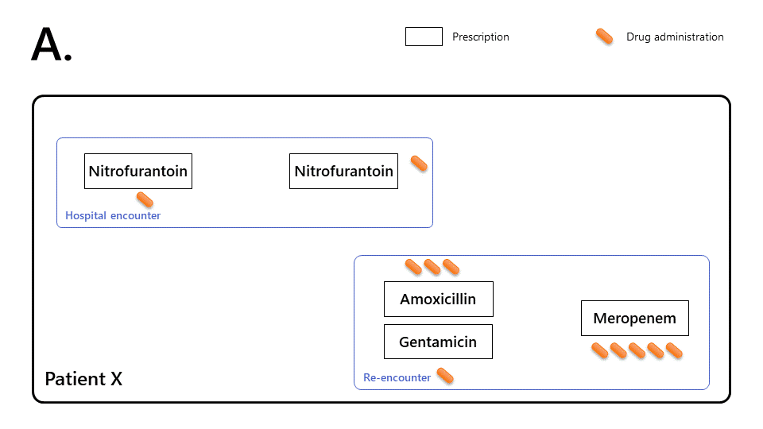
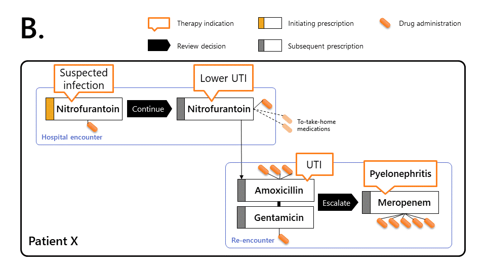

```{r setup, include = FALSE }
knitr::opts_chunk$set(
  collapse = TRUE,
  comment = "#>",
  paged.print = TRUE,
  df_print = "paged"
)
```

<script>function openVisTab(evt, cityName) {
  // Declare all variables
  var i, tabcontent, tablinks;

  // Get all elements with class="tabcontent" and hide them
  tabcontent = document.getElementsByClassName("tabcontent");
  for (i = 0; i < tabcontent.length; i++) {
    tabcontent[i].style.display = "none";
  }

  // Get all elements with class="tablinks" and remove the class "active"
  tablinks = document.getElementsByClassName("tablinks");
  for (i = 0; i < tablinks.length; i++) {
    tablinks[i].className = tablinks[i].className.replace(" active", "");
  }

  // Show the current tab, and add an "active" class to the button that opened the tab
  document.getElementById(cityName).style.display = "block";
  evt.currentTarget.className += " active";
}
</script>
<style>
.diagram_caption > li {
  font-weight:bold;
}

.diagram_caption > li > p:nth-child(n+2) {
  font-weight:normal;
}

.diagram_caption {
  margin-top: 40px;
  margin-bottom: 40px;
  list-style-type: upper-alpha;
}

.patternDiagram {
  max-width: 120px;
}

.tab {
  overflow: hidden;
  border: 1px solid #ccc;
  background-color: #f1f1f1;
  margin-top: 40px;
}

.tab button {
  background-color: inherit;
  float: left;
  border: none;
  outline: none;
  cursor: pointer;
  padding: 14px 16px;
  transition: 0.3s;
}

.tab button:hover {
  background-color: #ddd;
}

.tab button.active {
  background-color: #ccc;
}

.tabcontent {
  display: none;
  padding: 6px 12px;
  border: 1px solid #ccc;
  border-top: none;
} 
</style>


# Introduction

Hospital patients with suspected infection are often treated with empirical antibiotics. Antibiotic treatment is usually reviewed 24--72 hours later. This often results in changes to the choice of drug, its dose, and/or route of administration. Ideally, these decisions are informed by microbial culture results from biological samples such as blood or urine. 

Understanding how antibiotics are used in the hospital underpins effective antimicrobial stewardship. This requires knowledge of the sequence of prescribing events and requires information on:

* the type of antibiotic (antibiotic class) used to initiate therapy
* subsequent changes to the original prescription, such as switching to a narrower/broader spectrum of antibiotic.

Ramses reconstructs prescribing events relating to an individual: it creates *antimicrobial therapy episodes*, which link the set of antimicrobial prescriptions administered consecutively or concurrently in a given patient.

# Therapy episodes in Ramses

## Motivating example

The diagrams below illustrates how to characterise prescribing events using Ramses.

<div class="tab">
  <button class="tablinks" onclick="openVisTab(event, 'Raw records')" id="defaultOpen">A. Raw records</button>
  <button class="tablinks" onclick="openVisTab(event, 'Linked records')">B. Records linked into a therapy episode</button>
</div>
<div id="Raw records" class="tabcontent">
  <div class="figure"></div>
</div>
<div id="Linked records" class="tabcontent">
  <div class="figure"></div>
</div>

<ol class="diagram_caption">
<li>
  <p>Based on unprocessed medical records alone, it is hard to characterise the chain of prescribing events.</p>
  <p>Patient X was prescribed nitrofurantoin (single dose + 3 day course) during a first encounter.</p>
  <p>Patient X re-presented to hospital 24 hours later and was treated with amoxicillin (1 day), gentamicin (single dose), and meropenem (5 day course).</p>
</li>
<li>
  <p>Ramses links prescriptions together (by transitive closure) to reconstruct the <i>therapy episode</i>, allowing more sophisticated observations:</p>
  <p>This makes it possible to determine that Patient X took antibiotics without interruption for 7 days.</p>
  <p>On first encounter, patient X was given a first dose of nitrofurantoin for a suspected lower urinary tract infection (UTI), then reviewed by a senior doctor and prescribed a three day course of the same antibiotic. The patient only spent one day in hospital during this period.</p>
  <p>During the following 24h, patient X’s worsening condition led them to re-present to hospital. Patient X was prescribed <i>combination therapy</i> (amoxicillin and a single dose of gentamicin). Patient X was prescribed combination therapy (amoxicillin and a single dose of  gentamicin). The patient was reviewed 24 hours later, diagnosed with  pyelonephritis and prescribed a 5-day course of meropenem.</p>
</li>
</ol>


## Therapy episodes objects

*Therapy episodes* and *therapy combinations* are created automatically by Ramses when loading data (see [methods](#methodology)). They are identified in the `drug_prescriptions` table in variables `therapy_id` and `combination_id`.


```{r create_db, message=FALSE, warning=FALSE}
library(Ramses)
library(dplyr)
ramses_db <- create_mock_database("ramses-db.duckdb")

tbl(ramses_db, "drug_prescriptions") %>% 
  filter(patient_id == "99999999998") %>% 
  collect() %>% 
  select(patient_id, prescription_id, combination_id, 
         therapy_id, therapy_rank, prescription_text) %>% 
  glimpse()
```

Therapy episodes are represented as objects of S4 class `TherapyEpisode`.

```{r demo_therapy_episode}
uti_episode <- TherapyEpisode(ramses_db, "d7c0310a08cf9f0f318276125cd282ed")
uti_episode
```


S4 class `TherapyEpisode` is capable of handling multiple therapy episodes at once.

```{r demo_therapy_multiepisodes}
TherapyEpisode(ramses_db, 
               c("d7c0310a08cf9f0f318276125cd282ed", 
                 "5528fc41106bb48eb4d48bc412e13e67"))
```

For more information on S4 classes used in Ramses and their associated methods, see the [Objects and classes vignette](ramses-objects.html).

# Longitudinal analysis

## Longitudinal tables

Therapy episodes can be studied by creating a longitudinal, hour-by-hour matrix called 'longitudinal table'.

```{r longitudinal_table_code, eval=FALSE}
longitudinal_table(uti_episode, collect = TRUE)
```
```{r longitudinal_table_output, echo=FALSE, paged.print=TRUE}
longitudinal_table(uti_episode, collect = TRUE) %>% 
  select(t, therapy_start, therapy_end, t_start, t_end, parenteral) %>% 
  rmarkdown::paged_table()
```


This basic table can be enhanced with [clinical features](#adding-clinical-features).

By default, route of therapy administration is indicated in the `parenteral` field: 

- `1` indicates that all drugs are administered via parenteral route (eg intravenously)
- `0` indicates that at least one drug is administered via another route (eg orally)
- `NA` marks short gaps between prescriptions.

The `parenteral_changes()` function extracts transitions from intravenous to oral therapy. The example below shows just one prescribing sequence that included intravenous therapy. This sequence was initiated at $t$ = 122, and ended at $t$ = 242, without ever being converted to oral administration (`NA`).

```{r parenteral_changes}
parenteral_changes(uti_episode)
```

This function returns as many vectors as there are sequences of parenteral administration:

```{r parenteral_changes_multiple}
parenteral_changes(TherapyEpisode(ramses_db, "a028cf950c29ca73c01803b54642d513"))
```

In this example, parenteral therapy was first initiated at $t$ = 0, then converted to oral administration at $t$ = 97, until $t$ = 144. A new sequence of parenteral therapy begins at $t$ = 146, all within the same therapy episode.

## Adding clinical features

Several functions can enhance therapy tables with variables characterising the clinical state and trajectory of the patient. For instance, we may be interested in temperature: 

- `clinical_feature_last()` fetches the most recent temperature value.
- `clinical_feature_mean()` computes a running arithmetic mean of the temperature time series.
- `clinical_feature_interval()` computes the number of observations falling within and outside a specified interval (eg 36°C--38°C) or lying below/above a specified threshold (eg 38°C).
- `clinical_feature_ols_trend()` computes the Ordinary Least Square (OLS) trend; including the slope parameter, enabling to measure whether temperature has been rising/stable/falling.

The example below demonstrates how to classify a patient as hypothermic/afebrile/febrile:

```{r classify_fever}
example_sepsis <- TherapyEpisode(ramses_db, "4d611fc8886c23ab047ad5f74e5080d7") %>% 
  clinical_feature_last(observation_code = "8310-5", hours = 6) 

longitudinal_table(example_sepsis, collect = TRUE) %>% 
  mutate(
    febrile = case_when(
      last_temperature_6h < 36 ~ "hypothermic",
      between(last_temperature_6h, 36, 38) ~ "afebrile",
      last_temperature_6h > 38 ~ "febrile",
      TRUE ~ NA_character_
    )
  ) %>% 
  select(t, t_start, t_end, last_temperature_6h, febrile) %>% 
  filter(t < 50)
```

Another example below tracks the blood neutrophil count, which provides insights into the patient's clinical progression following treatment. We want to know whether this parameter is going up, or down. The `hours` parameter is set to 48 hours: the function will look at all neutrophil counts in the last 48 hours. This should ensure we capture two recent values and can compute a slope.

```{r track_neutrophils, paged.print=TRUE}
clinical_feature_ols_trend(
  x = example_sepsis,
  observation_code = "751-8",
  hours = 48
) %>% longitudinal_table(collect = TRUE) %>% 
  select(t, t_start, ols_neutrophils_48h_slope, ols_neutrophils_48h_intercept, ols_neutrophils_48h_N) %>%
  filter(between(t, 10, 14) | between(t, 80, 84))
```

Note that the intercept is defined for $t$ = `t_start`. In other words, its value corresponds to the linear (straight line) extrapolation of the trend to `t_start`.

We can see that, at the time of therapy initiation, the neutrophil count was increasing by an average 0.09 per nanoliter every hour (neutrophilia). After 80 hours (day 3), we find first evidence of the neutrophil count going down at a rate of 0.09 per nanoliter every hour, returning to a normal range (2--7.5 10<sup>9</sup>/L). Depending on the patient's other vitals, this could indicate the infection is under control.

```{r dbDisconnect, include=FALSE}
DBI::dbDisconnect(ramses_db, shutdown = TRUE)
file.remove("ramses-db.duckdb")
```


# Methodology

## Prescription linkage

Ramses links prescriptions together if:

- prescriptions share the same `antiinfective_type`: antibacterials are linked with antibacterials, antifungals with antifungals, etc.
- `prescription_status` is *not* `"draft"`, `"entered-in-error"`,  `"cancelled"`, or `"unknown"`.

`Ramses` links prescriptions into episodes and combinations in two instances:

- by default, using the `load_medications()` function
- on request, by calling the `create_therapy_episodes()` function.

Both functions include a `transitive_closure_controls` argument, which controls parameters for linking prescriptions together into episodes and/or combinations, based on patterns of overlap or time elapsed between prescriptions (see defaults in the table below).

To change the default settings, consult the documentation `?transitive_closure_control`.


Table: Prescription overlap pattern classification rules and default settings [@DuteyMagni2021]

 Category | Pattern	| Conditions for <br> combination therapy |	Conditions for <br> continuation of therapy* |
 :-: | :----: | ------------- | -------- | 
 **1** | {.patternDiagram} | Ordered a max of 6h apart AND administrations separated by at the most 24h | Separated by at the most 36h  |
 **2** | {.patternDiagram} | Ordered a max of 6h apart AND drug is identical AND first administrations separated by at the most 24h | Separated by at the most 36h  |
 **3** | {.patternDiagram} | Never | Separated by at the most 36h |
 **4** | {.patternDiagram} | Never | Always |
 **5** | {.patternDiagram} | Ordered a max of 6h apart AND first administrations separated by at the most 24h | Always, unless combinations |
 **6** | {.patternDiagram} | Ordered a max of 6h apart AND first administrations separated by at the most 24h | Always, unless combinations |
 **7** | {.patternDiagram} | Never | Separated by at the most 36h |

*Notes:* 

- ○ denotes prescriptions for one-off administrations
- ▭ denotes regular prescriptions (including drugs to take home)
- $*$ for continuation edges, only monotherapy prescriptions and the first prescriptions within combinations (by drug alphabetical order) are used
- in all categories, the date of first administration of (A) is anterior or equal to the date of first administration of (B).


<script>
document.getElementById("defaultOpen").click();
</script>

# References
